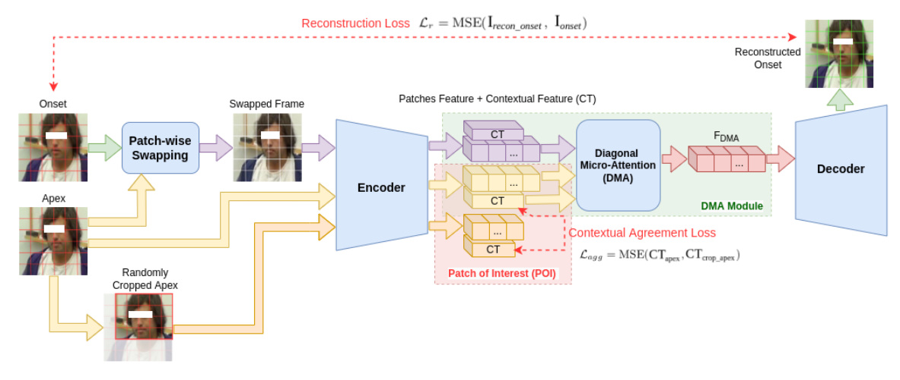

# micro_expression_autism
This is the implementation of one of my work on Face Micro-Expression Analysis on ADOS Videos for autism diagnosis.
This work is an undergoing work. The key codes and materials will be released after work is done. stay tuned!

# Introduction
Facial expression analysis has attracted great interest over the past years. It can be used in many real-life applications, like digital health, human machine interaction, behavior analysis, video communication, etc.

People with autism spectrum disorder (ASD) show socio-emotion interaction difficulties in communication disorder, emotional dysregulation with rigid and repetitive behaviors. These difficulties cause many problems related to performance of expressive language, social and emotional adaptive skills. People with autism usually do not show their emotions in a way that normal people would be able to recognize and understand. Either they do not respond emotionally, or their emotional responses might sometimes seem over-reaction.

Most previous study on facial emotion analysis for ASD mainly focus on macro-expression analysis, which is easily noticed and voluntary with long duration, large muscle variation. However, micro-expression, which is easy to ignore, involuntary, uncontrollable, and spontaneous with short duration and slight variation, often reflects the true feelings that a person try to conceal, hide, mask or suppress, especially important in high-risk situations, like clinical diagnosis, lie detection, and criminal investigation. 

In our work, we use computer vision and machine learning technology to analyze facial micro-expressions of participants in hour-long ADOS video sequences for the diagnosis of ASD.

# Data
ADOS means Autism Diagnostic Observation Schedule.

It is a structured but natural discussion between the highly trained interviewer and participant. 

The schedule contains 15 standardized activities: 

(1) Construction task: The participant is asked to use puzzle pieces to complete a diagram and is instructed to request more pieces when needed.

(2) Telling a story from a book: The book has very few words; The participant is asked to interpret the story from the visual cues, including reading emotions on the faces of the people in the story.

(3) Description of a Picture: A picture is shown. The participant is asked to describe this picture. The picture provides opportunities for interaction with the interviewer.

(4) Conversation and Reporting: Based largely on the picture the participant saw in (3), the participant is asked to talk more.
Scenes 5-7 focus more on conversation.
Scene 5 talks about work or school lives of the participant.
Scene 6 talks about Social Difficulties and Annoyance of the participant.
Scene 7 talks about the events/objects that elicit different emotions in the participant and asks  the participant to describe their feelings.

(8) Demonstration Task: The participant is asked to show and tell the interviewer how to do a typical procedure, such as brushing their teeth.

In scene (9) Cartoons, First, a series of cards showing cartoon characters are presented to the participant. These cards tell a story. Then the participant stands to re-tell the story. Their use of the gestures, emotions, and reference to relationships is evaluated finally.

In scene (10) Break, The participant is given a few items (like magazines, toys, color pens and papers); And the interviewer observes their behavior during this free time.

Scene 11 to 14 mainly focus more on conversation.
(11) Daily Living: Scene 11 talks about their current living situation. (12) Friends, Relationships, and Marriage. (13) Loneliness. (14) Plans and Hopes.

(15) Creating a Story: The participant is asked to use their imagination to create a novel story using some objects. 

For each activity, the interviewer gives the question, and the participants gives their response.
The response of participants to each activity is inspected by the interviewers.
Different scenes are designed for the analysis of different aspects of autism. 
This schedule can capture various information, like:
Hand gesture,
Face emotions,
Body behavior,
Speech traits,
gaze, etc.

# Data Augmentation
To get a more balance dataset, we make several data augmentation strategies on frames to enlarge data size, such as horizontal flipping,  brightness changing, histogram equalization, etc.

# Pipeline

It contains 4 steps: Pre-processing, Micro-expression Spotting, Feature extraction, and Classification.

(1) First, face frames are extracted from the video by detection and cropping.  

(2) Second, locate the Onset, apex, and Offset of each micro-expression movements in the videos. 

onset: the first frame at which a Micro-Expression (ME) starts. i.e., changing from the baseline, which is usually the neutral facial expression.

apex: the frame at which the highest intensity of the facial expression is reached.

offset: the last frame at which a ME ends, i.e., returning back to the neutral facial expression.

The spotting model is a shallow optical flow 3-stream CNN model taking different (3) optical flow feature of frames as input. 
Each stream consisting of a single convolutional layer with 3, 5, and 8 filters respectively, followed by a max-pooling layer to reduce the feature map size. The feature maps from each stream are then stacked channel-wise to combine the features, with another max-pooling layer thereafter. Finally, it flattens out to a 400-node layer, fully connected to a single output score via linear activation. 

It treats the spotting task as a regression problem that predicts how likely a frame belongs to a micro-expression. It outputs a spotting confidence score. Then score thresholding and peak detection are performed to obtain all micro-expression intervals in given video.

(3) Third, extract discriminative facial subtle muscle movement change feature from each spotted micro-expression subvideo. 

We use a BERT-based Auto Encoder as a base model (https://github.com/uark-cviu/Micron-BERT) to capture these micro-changes of facial texture in an unsupervised manner.

It consists of five main blocks. 

Two input frames (onset and apex) are first divided into a set of several non-overlapping patches, respectively.

(a) patch-wise Swapping: randomly swap patches between onset and apex frames to create a swapped image.

(b) Encoder: represent input into latent vectors. 

(c) Patch of Interest (PoI): enable the model to look into facial regions containing micro-expressions, not unrelated regions, like background.

(d) Diagonal Micro Attention (DMA): allow the model to focus on facial regions that primarily consist of micro differences between frames.

(e) Decoder: reconstructs the output signal using latent code.

The final feature (F_DMA) captures the micro-changes between apex and onset, and micro-changes in facial regions.
It can be a discriminative representation of a micro-expression movement.

(4) Last, the final representation is fed into SVM for final classification.

### Link: 
More details can be referred to my thesis (Section 4.4). 
[[PDF]](https://researchrepository.wvu.edu/etd/11861/)

# Content
This repository contains the implementation of:
* Video pre-processing
* Optical flow calculation
* Micro-expression spotting
* Feature extraction using Autoencoder
* classifiaction using SVM (10-fold cross validation)

  
